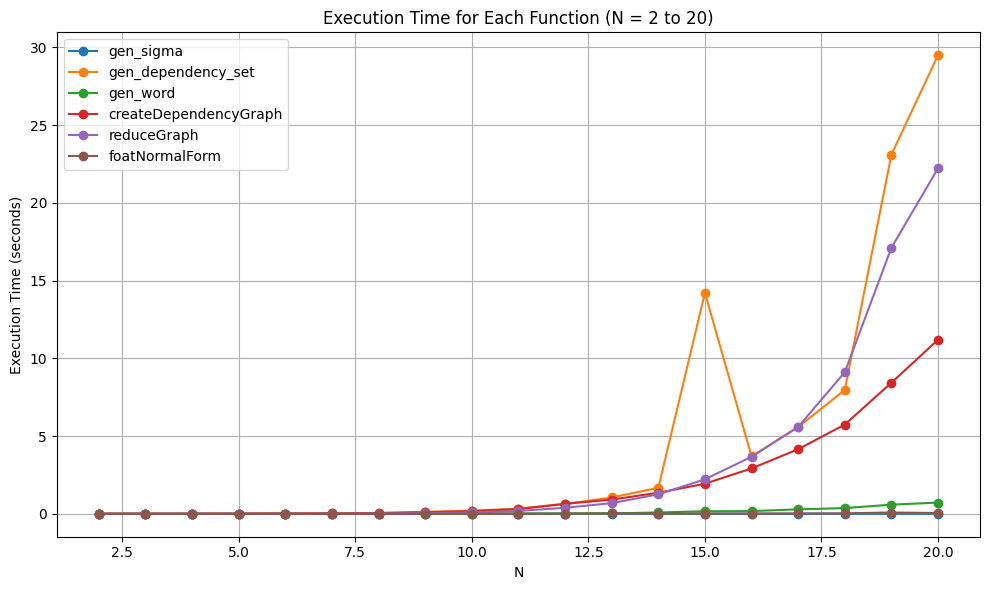
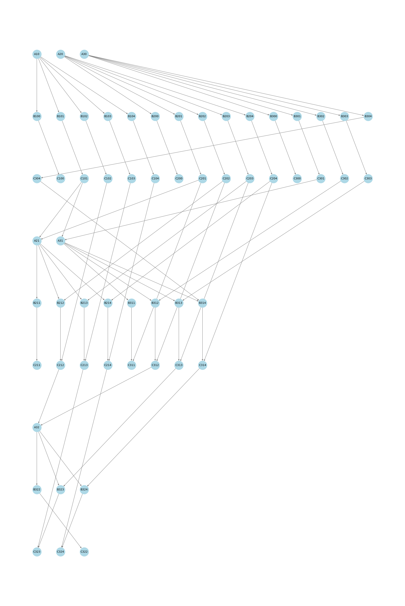
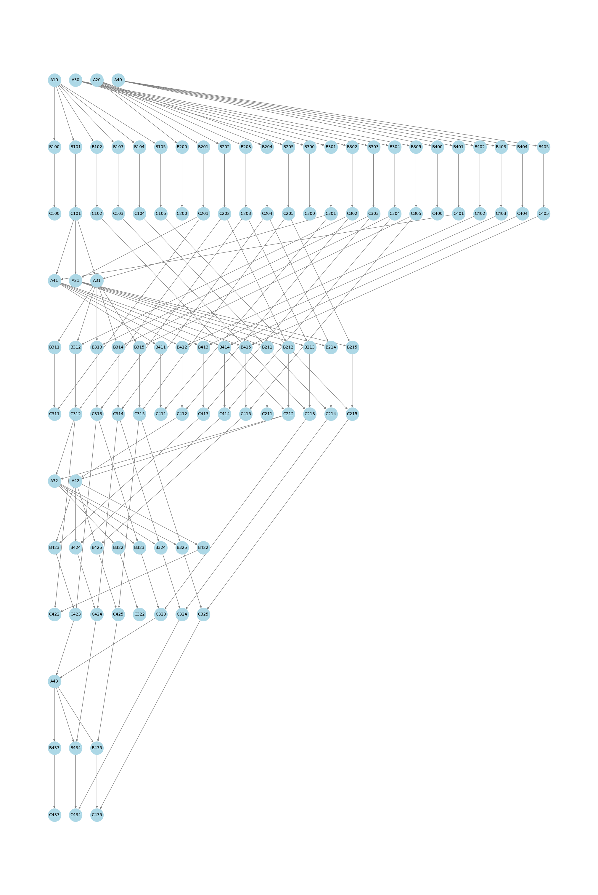
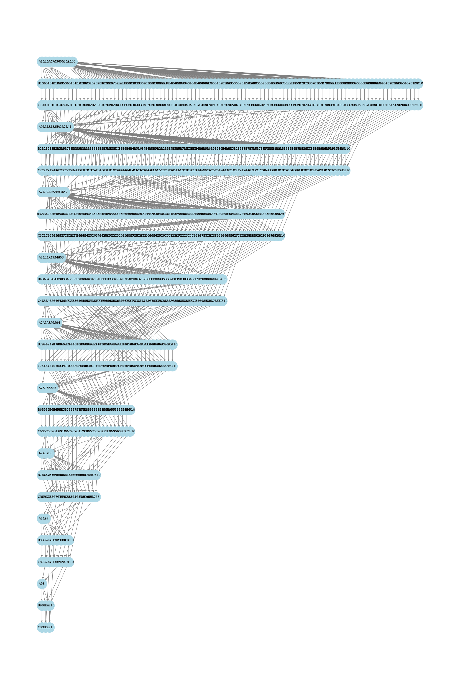
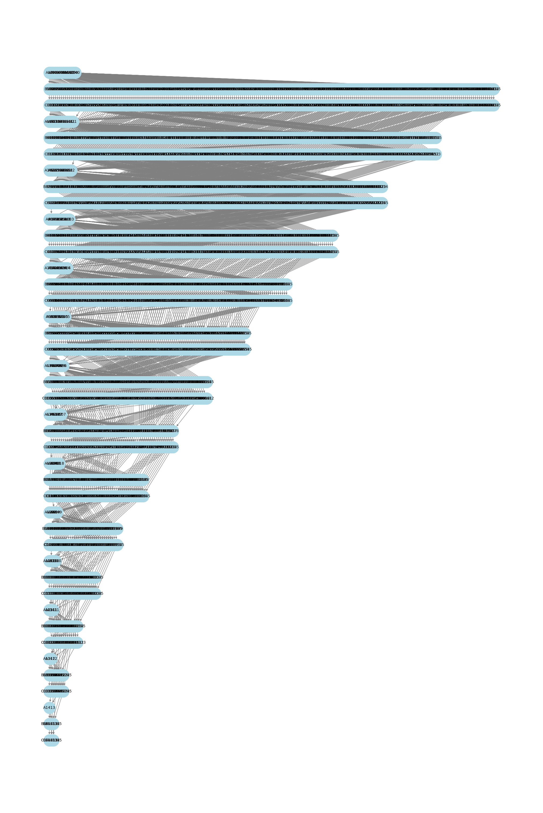
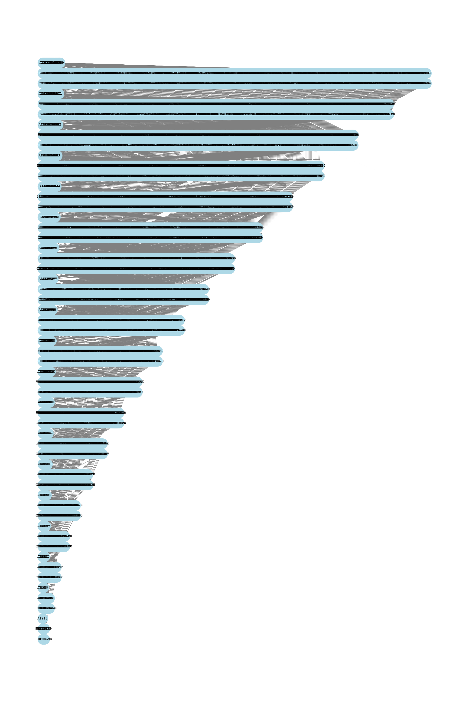

# Teoria współbieżności Zadanie 7

## Autor Ernest Szlamczyk

### 1. Wstęp

Sprawozdanie to dotyczy **projektowania i implementacji współbieżnego algorytmu eliminacji Gaussa**. Kod zawiera się w pliku `TWZAD2.py` a aby go uruchomić wystarczy wykonać:

`python(/python3) TWZAD2.py <ścieżka do pliku wejściowego> <ścieżka do pliku wyjściowego> <opcjonalna flaga>`

gdzie `opcjonalna flaga` dotyczy wypisywania wyników na standardowe wyjście; w każdym przypadku kiedy istnieje i jest różna od `0` program wypisze:

-   $\Sigma$
-   $D$
-   $\omega$
-   $FNF[\omega]$
-   oraz Graf Diekerta (domyślnie jako macierz sąsiedztwa, ale pozostawiłem zakomentowany fragment kodu który stworzy obrazek grafu (dla większych N robią się one na prawde piękne $:)$ ))

### 2. Wymagania

Wszystko było testowane przy użyciu `Pythona 3.10.12`

Dodatkowo wykorzystywane biblioteki to:

-   torch (do algorytmu)
-   matplotlib oraz networkx (do rysowania grafu)

Wszystko działa bez szwanku dla mniejszych N (N $\leq$ 25). Dla większych N algorytm przegrywa z systemem operacyjnym i proces jest zabijany.

### 3. Definicja operacji

Operacje (niepodzielne czynności wykonywane przez algorytm) zostały przezemnie zdefiniowane w następujący sposób:

Dla macierzy M:

$$
\begin{bmatrix}
M_{00} & M_{01} & M_{02} & M_{03} & \cdots & M_{0N} \\
M_{10} & M_{11} & M_{12} & M_{13} & \cdots & M_{1N} \\
M_{20} & M_{21} & M_{22} & M_{23} & \cdots & M_{2N} \\
\vdots & \vdots & \vdots & \vdots & \ddots & \vdots \\
M_{(N-1)0} & M_{(N-1)1} & M_{(N-1)2} & M_{(N-1)3}  & \cdots  & M_{(N-1)N} \\
\end{bmatrix}
$$

Definiujemy odpowiadającą jej macierz m i n

Następnie dane są 3 operacje:

$$
A_{ji} => m_{ji} = M_{ji} / M_{ii}
$$

$$
B_{jik} => n_{jk} = M_{ik} * m_{ji}
$$

$$
C_{jik} => M_{jk} = M_{jk} - n_{jk}
$$

gdzie $/$ oznacza dzielenie, $*$ mnożenie, a $-$ odejmowanie

Te operacje są wystarczające do wykonania eliminacji gaussa (bez pivotingu)

Kod w pythonie, który implementuje te operacje

```py
class Operation:
    def __init__(self, op_type, j, i, k=None) -> None:
        self.op_type = op_type
        self.j = j
        self.i = i
        self.k = k

    def __str__(self):
        return f"A{self.j}{self.i}" if self.op_type == "A" else f"{self.op_type}{self.j}{self.i}{self.k}"

    def __repr__(self):
        return f"A{self.j}{self.i}" if self.op_type == "A" else f"{self.op_type}{self.j}{self.i}{self.k}"

    def __eq__(self, other):
        if not isinstance(other, Operation):
            return False
        return other.op_type == self.op_type and other.j == self.j and other.i == self.i and other.k == self.k

    def __hash__(self):
        return hash((self.op_type, self.j, self.i, self.k))

```

_tak jestem świadom faktu, że technicznie rzecz biorąc C nie potrzebuje i, ale warto zauważyć że to dodatkowe i odnosi się do tego że następuje ono po Bjik dlatego ono tam zostało (no i przyokazji działa, więc nie chce robić wszystkiego od nowa :p )_

### 4. Generowanie alfabetu

Generowanie alfabetu jest zadane prostym wzorem:

$$
\Sigma = \{A_{ji},B_{jik},C_{jik} | \forall i < N, \forall j : i < j < N, \forall k: i \leq k \leq N , (i,j,k) \in \mathbb{N} \}
$$

wygenerowanie tego w pythonie wygląda następująco:

```py
def gen_sigma(N):
    sigma = set()

    for i in range(N):
        for j in range(i+1, N):
            sigma.add(Operation("A", j, i))
            for k in range(i, N+1):
                sigma.add(Operation("B", j, i, k))
                sigma.add(Operation("C", j, i, k))

    return sigma
```

Warto zauważyć że bardzo nadużywam tutaj `setów` i `słowników` ze zwględu na ich dostęp do elementu który jest w O(1)

### 5. Generowanie zbioru zależności

Po wielkich obliczeniach (kreśleniu po macierzach przez 3 godziny) wyprowadziłem wzór na D:

$$
D = sym\{(D_1 \cup D_2 \cup D_3 \cup D_4 \cup D_5)^+ \} \cup I_{\Sigma}
$$

Gdzie:

$$
D_1 = \{ (A_{ji}, B_{jik}) | \forall i < N, \forall j : i < j < N, \forall k: i \leq k \leq N , (i,j,k) \in \mathbb{N} \}
$$

$$
D_2 = \{ (B_{jik}, C_{jik}) | \forall i < N, \forall j : i < j < N, \forall k: i \leq k \leq N , (i,j,k) \in \mathbb{N} \}
$$

$$
D_3 = \{ (C_{jak},A_{ji}),(C_{iak},A_{ji}) | \forall i: 1 \leq i < N,  \forall j : i < j < N, k = i,\forall a < i, (i,j,k,a) \in \mathbb{N}\}
$$

$$
D_4 = \{(C_{j(i-1)k},B_{jik})| \forall i: 1 \leq i < N,  \forall j : i < j < N, \forall k: i \leq k \leq N, (i,j,k) \in \mathbb{N}\}
$$

$$
D_5 = \{(C_{(j-1)(i-1)k},C_{jik}), (C_{j(i-1)k},C_{jik}) | \forall i: 1 \leq i < N,  \forall j : i < j < N, \forall k: i \leq k \leq N, (i,j,k) \in \mathbb{N}\}
$$

$D_1$ wynika z dosyć oczywistego `Aby wykonać operacje B należy wcześniej mieć wypełnione pole w m które jest wypełniane w operacji A`

$D_2$ wynika z tak samo oczywistej relacji między B i C

$D_3$ wynika z faktu, że aby policzyć kolejne A (nie licząc początkowego rzedu i kolumny) należało policzyć wszystkie C które są "wyżej" patrząc z perspektywy macierzy

$D_4$ wymika z z tego aby wykonać operacje B musimy mieć zaktualizowane M czyli należy wykonać wcześniejszą operacje C

$D_5$ wynika z podobnego wniosku co $D_4$

#### 5.1 Zapisując to w pythonie...

Otrzymujemy:

```py
def add_symmetry(D: set[tuple[Operation, Operation]]):
    to_add = set()
    for elem in D:
        to_add.add((elem[1], elem[0]))
    D.update(to_add)


def add_transitive_closure(D: set[tuple[Operation, Operation]]) -> set[tuple[Operation, Operation]]:
    def dfs(node, reachable):
        nonlocal Graph
        if node not in Graph:
            return
        for neighbour in Graph[node]:
            if neighbour not in reachable:
                reachable.add(neighbour)
                dfs(neighbour, reachable)

    Graph = dict()

    for (a, b) in D:
        Tab = Graph.get(a, [])
        Tab.append(b)
        Graph[a] = Tab

    closure = {node: set() for node in Graph}
    for node in Graph:
        dfs(node, closure[node])

    result = set()
    for node in closure:
        for reachable_node in closure[node]:
            result.add((node, reachable_node))

    return result


def gen_dependency_set(N):
    D = set()
    D1 = set()
    D2 = set()
    D3 = set()
    D4 = set()
    D5 = set()

    I_sigma = set()

    for i in range(N):
        for j in range(i+1, N):
            for k in range(i, N+1):
                D1.add((Operation("A", j, i), Operation("B", j, i, k)))
                D2.add((Operation("B", j, i, k), Operation("C", j, i, k)))

    for i in range(1, N):
        for j in range(i+1, N):
            for a in range(i):
                D3.add((Operation("C", j, a, i), Operation("A", j, i)))
                D3.add((Operation("C", i, a, i), Operation("A", j, i)))

    for i in range(1, N):
        for j in range(i+1, N):
            for k in range(i, N+1):
                for a in range(i):
                    D4.add((Operation("C", j, a, k), Operation("B", j, i, k)))

    for i in range(1, N):
        for j in range(i+1, N):
            for k in range(i, N+1):
                D5.add((Operation("C", j-1, i-1, k), Operation("C", j, i, k)))
                D5.add((Operation("C", j, i-1, k), Operation("C", j, i, k)))

    for elem in gen_sigma(N):
        I_sigma.add((elem, elem))

    D = D1 | D2 | D3 | D4 | D5

    D = add_transitive_closure(D)
    add_symmetry(D)

    return D | I_sigma
```

$D_1, D_2, D_3, D_4, D_5$ powstają bezpośrednio z rozpisanych wzorów, następnie tworzymy $I_{\Sigma}$ w dodając wszystkie pary $(a,a)$, gdzie $a \in \Sigma$.
Następnie aby dodać przechodniość dla każdej możliwej operacji wykorzystałem algorytm **DFS**, którego uruchamiam na każdym wieszchołku aby dowiedzieć się gdzie jestem w stanie się dostac z tego wieszchołka, a następnie dodaje krawędź na tej podstawie. Na końcu dodawanie symetrii jest prostym dodaniem każdego elementu ułożonego na odwrót

### 6. Generowanie słowa $\omega$

Słowo można opisać w prostej zależności:
Pierwsze generujemy A potem wykonujemy odpowiadające mu B i C
gdzie a będą szły w od lewego górnego rogu macierzy w dół

$$
\omega =
<A_{10},B_{100},B_{101},\cdots B_{10N}, C_{100},C_{101},\cdots,C_{10N},
$$

$$
A_{20},B_{200},B_{201},\cdots B_{20N}, C_{200},C_{201},\cdots,C_{20N},
$$

$$
\vdots
$$

$$
A_{(N-1)0},B_{(N-1)00},B_{(N-1)01},\cdots B_{(N-1)0N}, C_{(N-1)00},C_{(N-1)01},\cdots,C_{(N-1)0N},
$$

$$
A_{21},B_{211},B_{212},\cdots B_{21N}, C_{211},C_{212},\cdots,C_{21N},
$$

$$
A_{31},B_{311},B_{312},\cdots B_{31N}, C_{311},C_{312},\cdots,C_{31N},\\
$$

$$
\vdots \\
$$

$$
A_{(N-1)1},B_{(N-1)11},B_{(N-1)12},\cdots B_{(N-1)1N}, C_{(N-1)11},C_{(N-1)12},\cdots,C_{(N-1)1N},\\
$$

$$
\vdots \\
$$

$$
A_{(N-1)(N-2)},B_{(N-1)(N-2)(N-2)},B_{(N-1)(N-2)(N-1)}, B_{(N-1)(N-2)N}, C_{(N-1)(N-2)(N-2)},C_{(N-1)(N-2)(N-1)},C_{(N-1)(N-2)N}>
$$

Co w pythonie wygląda następująco:

```py
def gen_word(N):
    w = []
    for i in range(N-1):
        for j in range(i+1, N):

            w.append(Operation("A", j, i))
            for k in range(i, N+1):
                w.append(Operation("B", j, i, k))
            for k in range(i, N+1):
                w.append(Operation("C", j, i, k))

    return w
```

### 7. Generacja grafu Diekerta i postaci normalnej Foaty

Właściwie rzecz biorąc nic się tu nie zmienia względem poprzedniego laboratorium. Jedynym wyjątkiem jest fakt, że tutaj te zbiory są zdecydowanie większe więc postanowiłem zoptymalizować redukcje grafu, aby używała głównie zbiorów zamiast tablic co zdecydowanie przyśpieszyło algorytm z $O(n^4)$ do $O(n^3)$ gdzie n to ilość krawędzi w grafie których jest rzędu np. 50 tysięcy dla N = 30

```py
def reduceGraph(graph):
    n = len(graph)

    graph = [set(neighbors) for neighbors in graph]

    for u in range(n):
        to_remove = set()

        for v in graph[u]:
            to_remove.update(graph[u] & graph[v])

        graph[u] -= to_remove

    return [list(neighbors) for neighbors in graph]
```

i reszta kodu dla dokładności:

```py
def gen_independency_set(Dependency_set: set, Sigma: set):
    # add everything that is not in D
    I = set()
    for elem1 in Sigma:
        for elem2 in Sigma:
            if (elem1, elem2) not in Dependency_set:
                I.add((elem1, elem2))
    return I


def createDependencyGraph(w, D):
    graph = [[] for _ in range(len(w))]
    for i in range(len(w)):
        for j in range(i+1, len(w)):
            if (w[i], w[j]) in D:
                graph[i].append(j)

    return graph

def foatNormalForm(graph, w):
    graph2 = deepcopy(graph)
    result = []
    resultNumbers = []
    included = [False] * len(w)
    while False in included:
        fullset = {i for i in range(len(w)) if not included[i]}
        seen = set()
        for node in graph2:
            for v in node:
                seen.add(v)
        resultset = fullset - seen

        currFoat = []
        currArr = []
        for item in resultset:
            currArr.append(item)
            included[item] = True
            currFoat.append(w[item])
            graph2[item] = []

        result.append(currFoat)
        resultNumbers.append(currArr)

    return result, resultNumbers


def drawGraph(graph, w, FNF_helper):
    print(graph)
    G = nx.DiGraph()
    for i in range(len(graph)):
        G.add_node(i)
    for node, neighbors in enumerate(graph):
        for neighbor in neighbors:
            G.add_edge(node, neighbor)

    node_labels = {node: w[node] for node in range(len(w))}

    pos = {}

    for i in range(len(FNF_helper)):
        for j in range(len(FNF_helper[i])):
            pos[FNF_helper[i][j]] = (j, -1*i)

    plt.figure(figsize=(20, 30))

    nx.draw(
        G, pos, with_labels=False, node_color='lightblue', edge_color='gray',
        node_size=1000
    )

    nx.draw_networkx_labels(G, pos, labels=node_labels,
                            font_size=10, font_color='black')
    plt.axis('off')
    plt.show()
```

Pomijając małe zmiany w wielkościach w grafie to nic tutaj się nie zmieniło

### 8. Algorytm współbieżny z schedulerem

Aby osiągnąć równoległość na GPU zastosowałem biblioteke `torch` której tensory można przepisać na wskazane urządzenie w tym na gpu przy użyciu `CUDY`:

```py
    #...
    device = torch.device("cuda:0" if torch.cuda.is_available() else "cpu")
    #...
    Matrix = torch.zeros((N, N+1), dtype=torch.float32, device=device)
    #...
```

W domyśle torch implementuje własny scheduler, ale dzięki funkcji `torch.cuda.synchronize()` możemy "wstrzymać" prace CPU do momentu aż wszystkie zakolejkowane operacje na GPU się wykonają. (Jest to wolniejsze, ze względu na dużą ilośc komunikacji procesor - karta graficzna, ale na potrzeby zadania poświęcam te cenne operacje).

Algorytm wygląda następująco:

-   Stwórz pomocnicze macierze $m$ i $n$
-   Dla każdego bloku operacji
-   Dla każdej operacji
-   zdekoduj rodzaj operacji, j, i oraz ewentualne k
-   wykonaj odpowiednią (zależną od rodzaju operacji) operacje
-   po wykonaniu bloku poczekaj aż gpu skończy prace i rozpocznij kolejny blok

```py
def manual_scheduler(Matrix, FNF, should_print):
    if should_print:
        print(f"EXECUTING PARALEL ALGORITHM ON:\n{Matrix}")

    n, m = Matrix.shape

    m_Matrix = torch.zeros_like(Matrix, device=Matrix.device)
    n_Matrix = torch.zeros_like(Matrix, device=Matrix.device)

    for block_id, block in enumerate(FNF):
        if should_print:
            print(f"Executing Block {block_id + 1}: {block}")
        for op in block:

            if op.op_type == "A":
                j, i = op.j, op.i
                m_Matrix[j, i] = Matrix[j, i] / Matrix[i, i]

            elif op.op_type == "B":
                j, i, k = op.j, op.i, op.k
                n_Matrix[j, k] = Matrix[i, k] * m_Matrix[j, i]

            elif op.op_type == "C":
                j, i, k = op.j, op.i, op.k
                Matrix[j, k] -= n_Matrix[j, k]
                if abs(Matrix[j, k]) < 1e-6:
                    Matrix[j, k] = 0

            else:
                # :)
                raise ValueError(f"K***a jak: {op}")

        torch.cuda.synchronize()

    return Matrix
```

#### 9. Parsowanie wejścia/wyjścia

Jak było wspomniane wcześniej wejście i wyjście są w postaci plików `.txt` gdzie kolejne linijki to:

-   wielkość macierzy N
-   N wierszy macierzy (długości N)
-   wektor do rozszerzonej macierzy (też długości N)

Dla wygody odczytów dodałem wymuszone zera aby liczba była zawsze conajmniej 8 znaków długości oraz dodatkową spacje aby `-` w liczbach negatywnych nie psuł wyglądu wyniku

Kod:

```py
def parse_input(input_file, device):
    first_line = True
    matrix_row = 0
    for line in open(input_file, "r"):
        line.strip()
        if first_line:  # ah yes programer
            N = int(line)
            Matrix = torch.zeros((N, N+1), dtype=torch.float32, device=device)
            first_line = False
            continue
        if matrix_row < N:
            elements = [float(i) for i in line.split()]
            for i, elem in enumerate(elements):
                Matrix[matrix_row, i] = elem
            matrix_row += 1
        else:
            elements = [float(i) for i in line.split()]
            for i, elem in enumerate(elements):
                Matrix[i, N] = elem
            break

    return N, Matrix


def save_output(N, Matrix, output_file):
    with open(output_file, 'w') as f:
        f.write(f"{N}\n")

        for row in Matrix:
            square_matrix_row = " ".join(f"{x: .{8}f}" for x in row[:-1])
            f.write(f"{square_matrix_row}\n")

        additional_vector = " ".join(
            f"{x: .{8}f}" for x in [row[-1] for row in Matrix])
        f.write(f"{additional_vector}\n")
```

### 10. Reszta kodu dla porządku

Funkcja licząca czas i wywołująca wszystkie funkcje:

```py
def main_function(N, Matrix, should_print):
    start = time.time()

    Sigma = gen_sigma(N)
    D = gen_dependency_set(N)
    w = gen_word(N)
    G = reduceGraph(createDependencyGraph(w, D))
    FNF, FNF_NUMBERS = foatNormalForm(G, w)

    fnf_time = time.time()
    result = manual_scheduler(Matrix, FNF, should_print)

    # result prints
    if should_print:
        print(f"Sigma = {Sigma}")
        print(f"D = {D}\n")
        print(f"w = {w}\n")
        print(f"RESULT FNF:\n{FNF}\n")
        print(f"Graf Diekerta:\n{G}\n")
        # drawGraph(G, w, FNF_NUMBERS)

        print(f"Final Resultant Matrix:\n{result.cpu().numpy()}")

    end = time.time()
    print(
        f"Done :) \nTime to create FNF: {(fnf_time-start):.{4}f}s \nTime to perform paralel algorithm: {(end-fnf_time):.{4}f}s")

    return result.cpu().numpy()
```

Oraz główny element wywołujący wszystko i przyjmujący wejście

```py
if __name__ == "__main__":

    device = torch.device("cuda:0" if torch.cuda.is_available() else "cpu")

    if len(sys.argv) < 3:
        raise Exception("Please provide filename!")
    else:
        input_file, output_file = sys.argv[1:3]

    should_print = False
    if len(sys.argv) > 3:
        should_print = (sys.argv[3] != "0")

    N, Matrix = parse_input(input_file, device)
    Matrix = main_function(N, Matrix, should_print)
    save_output(N, Matrix, output_file)
```

### 11. Wyniki

W zipie dostarczyłem 2 foldery:

-   data (przykładowe wejścia)
-   result (odpowiadające im wyjścia)

Jak widać algorytm sprowadza je do macierzy trójkątnej górnej

Dodatkowo postanowiłem zbadać długości wykonywania funkcji dla poszczególnych N-ów


Można zauważyć tutaj wzrozt eksponencjalny gdzie największymi mankamentami jest redukowanie grafu i generowanie $D$ (głównie przechodniość). Pokazuje to że warto było optymalizować te 2 funkcje

### 12. Kwiatki tak na dodatek :)

#### 12.1 Graf Diekerta dla N = 4

test

test

#### 12.2 Graf Diekerta dla N = 5

test

test

#### 12.3 Graf Diekerta dla N = 10

test

test

#### 12.3 Graf Diekerta dla N = 15

test

test

#### 12.4 Graf Diekerta dla N = 20

test

test

_Nie rozumiem dlaczego ale konwerter nie chce wrzucić tych zdjęć bez tych testów więc zostają tam_

Lepiej widać w Folderze Sprawozdanie, którego także dołączam
